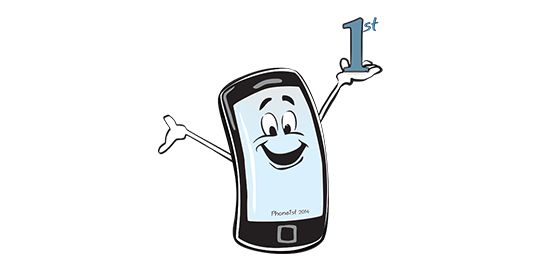

# Welcome to Phone1st

## A light, clean, starter theme that starts... _phone1st_

> A light and basic html starter theme to get you off to a quick start with your web developments. The CSS is put together using SCSS, a popular way of creating quick, organised stylesheets. Using Phone1st will save you time, building quicker, smarter projects. Once you start using Phone1st you'll keep using it.

* * *

### Quick Start

**Download** - **Rename the folder** - **Import into CodeKit**

Remove **css/\_start.scss**

Alter/Remove **google site verification** - includes/\_header.kit

Alter/Remove **google analylitics** - includes/\_scripts.kit

Build your site with the help of the **test folder**

Remove the **test folder**

Upload the **build folder** to your server

* * *

### CodeKit

Phone1st is designed to be used with [CodeKit](https://codekitapp.com/) (_Mac only_). Taking advantage of _CodeKits_ - _kit_ templates and _kit_ variables.

If you don't have _CodeKit_ the _css_ folder and _scss_ files can be adapted to suit your use.

The theme should build correctly when imported into Codekit, but if not:

_You can delete the **build** folder and **re-build**._

_Remove the **config.codekit3** file and re-import into **CodeKit** using your CodeKit settings_

_You can set the paths to suit yourself but phone1st uses:_

- style.scss - /build/css/style.css
- app.js - /build/js/app.js
- images - /build/images/
- index.kit - /build/index.html
- privacy.kit - /build/privacy.html

To view the _test folder pages_

- test.kit - /build/test/test.html
- about.kit - /build/test/about.html
- scss.kit - /build/test/scss.html
- extras.kit - /build/test/extras.html
- layout.kit - /build/test/layout.html
- flexbox.kit - /build/test/flexbox.html

- base.scss - /build/test/css/base.css
- extras.scss - /build/test/css/extras.css
- layout.scss - /build/test/css/layout.css
- flexbox.scss - /build/test/css/flexbox.css

- all extras js files go into the js folder /build/test/js/
- all test images to /build/test/test-images/

* * *

### The Test Folder
The _test_ folder can be removed when no longer required it will not effect the theme.

#### Test Page
Use the _test_ page to set the basic elements.

#### Extras Page
A few javascript extras to start you off.

#### Scss Page
User and _Bourbon_ mixins used with the _Phone1st_ theme.

#### Layout Page
Basic _Grid Css_ page layout.

#### Flexbox Page
Basic _Flexbox_ introduction.

* * *

### Basic SEO

The following _variables_ for Meta Data are available with some _Facebook_ and _Twitter_ meta. These are optional and you should add or subtract what you require.

Meta variables available:

	<!-- $title Page Title --> - //Basic page title for use with navigation etc. eg _Home, About, etc
	
	<!-- $SEO-title A Longer Title--> - //A more descriptive title - 60ish characters
	
	//Note: Your sitename is added after the $SEO-title

	<!-- $description Page Description --> - //120ish characters

	<!-- $keyword Home, About --> - //word or words

	<!-- $url index.html --> - //exact url - canonical

	<!-- $post-image eg tile-wide.png --> - //image to use for Facebook and Twitter meta image

See _includes/\_meta.kit_, set the website path and sitename at the top of the page. The page variables _(from the top of each page)_, along with your website path and sitename will be used to set the meta data.

sitename is usually the name in your web address ie _www.mysitename.com_ - your sitename would be _mysitename_

**Important** - Check the meta data in your _page head_ with the browser inspector

* * *

### NOTES

#### Dart Scss

The math division is changing in _Dart Scss_

	@use "sass:math";//already in style.scss
	
	//WRONG, will not work in future Sass versions. @debug (12px/4px); //3
	
	// RIGHT, will work in future Sass versions. @debug math.div(12px, 4px); //3

for more information [click here](https://sass-lang.com/documentation/breaking-changes/slash-div)

* * *

### View Phone1st Theme

[Phone1st Starter Theme](https://phone1st.org/)

* * *

### Contact Info

email: <mailto:h@howardlucas.co.uk>
